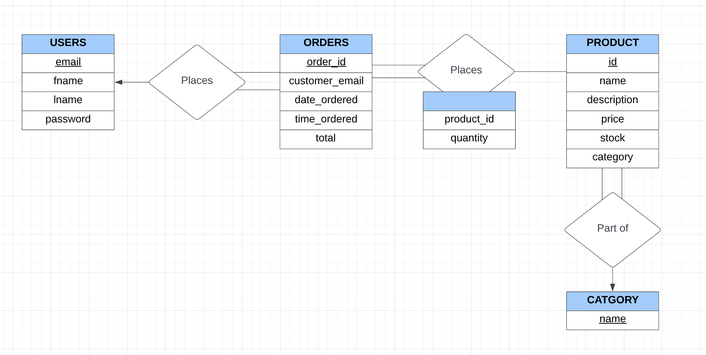
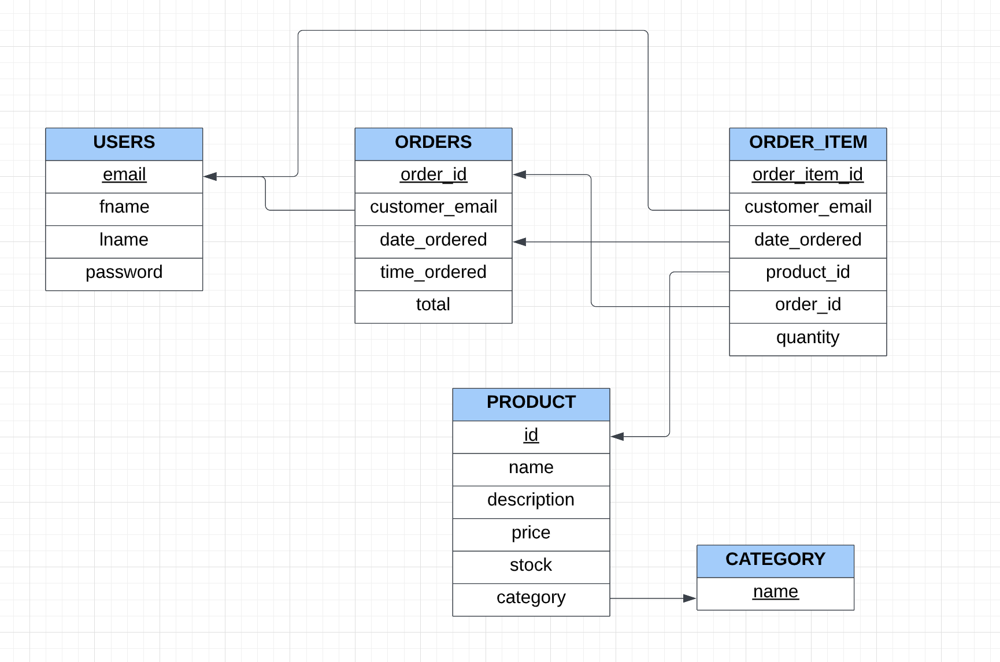

## Features
The website is able to display products being sold in several categories. A user visiting the web store can search for products (i.e., search for a specific item name and display that item or similar items) or display all items in a certain category. The website displays the available quantity and price for each product.

Only a logged in user can add products to a shopping cart and then checkout to complete a purchase and buy the products. To "buy" a product means to reduce the quantity from that product with the quantity that was "bought".  A user cannot add an item to their cart if the store does not have that quantity of item in stock.  

A logged in user's shopping cart can be viewed, edited, checked out or deleted. A logged in user can also see her order history which should include the list of items purchased and total cost of the order. A user who is not logged in can still view the products, however any attempt to add an item to cart will redirect to the login page.  

A logged in user can also view their order history.  They can search for specific products in their order history and it will return that item and when it was ordered.  The user can also arrange their order history by most recent or least recent.  

The database is updated on two occassions.  Every time a new user is created their information is added to the database, and everytime that a logged in user checks out their order history is updated.  

## Implementation
- Python Flask is used for all the server side scripting.
- The database is created using sqlite3.  
- HTML and CSS are used for all front end development.  
- The cart and logged in user are implemented with Session variables.

## ER Diagram

## SQL Schema Diagram

